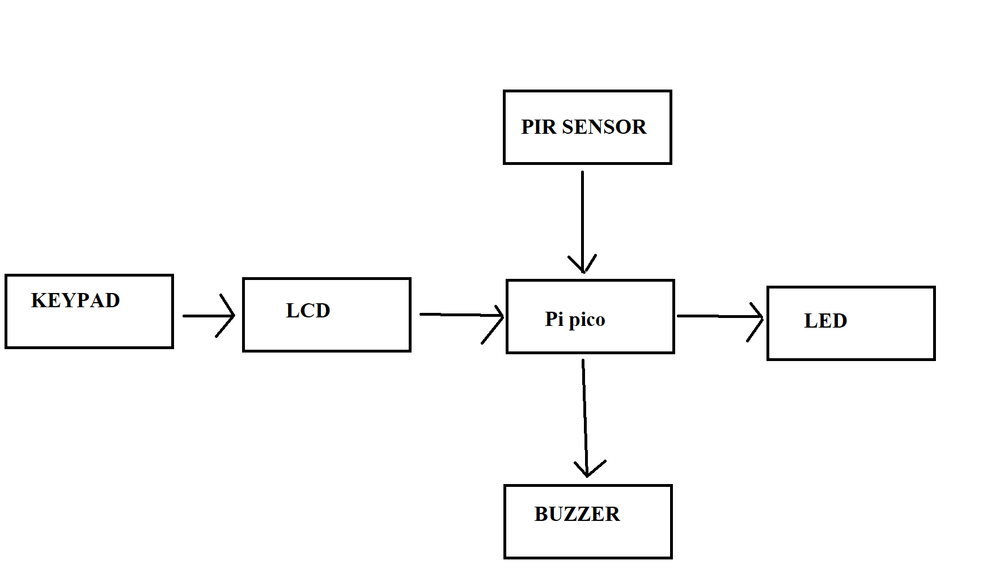
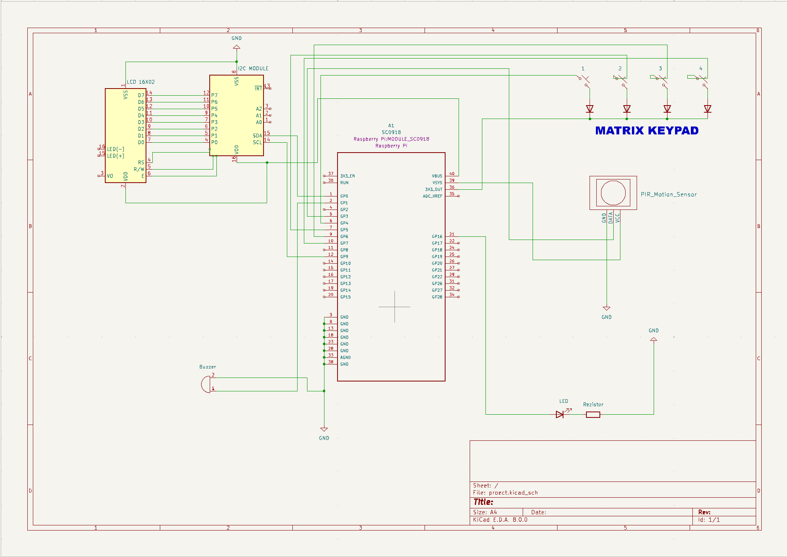

# SmartGuard: Raspberry Pi Pico W Burglar Alarm System

 Raspberry Pi Pico W-powered Smart Burglar Alarm System with Multi-Sensor Detection.
=======
# Burglar alarm with notification via email

 A smart burglar alarm system, equipped with motion detection, email alerts and keypad for security.

:::info 

**Author**: RATA MIRCEA-ANDREI \
**GitHub Project Link**: https://github.com/UPB-FILS-MA/project-MirceaAndrei/tree/main

:::

## Description

This project provides an opportunity to develop a smart alarm system tailored to modern security requirements. It offers a practical and efficient solution to detect intruders with advanced technology. Its compact, user-friendly design allows for seamless implementation in a wide range of environments, providing enhanced safety and peace of mind. Moreover, with its ability to send real-time notifications via email, users can stay informed about potential threats and respond quickly to protect their property.
 
# How it works:

For this project, we have developed a comprehensive alarm system utilizing a range of hardware components to enhance security and convenience. At the core of this system is the Raspberry Pi Pico W, which serves as the central controller and processor. This microcontroller integrates Wi-Fi capabilities, enabling the system to communicate and send notifications over the internet.

The system is equipped with a Passive Infrared (PIR) sensor, which is designed to detect motion in its vicinity. When the PIR sensor registers movement, it triggers an immediate response from the system: both an LED and a buzzer are activated, alerting those nearby of potential activity. Simultaneously, the Raspberry Pi Pico W sends an email notification to a specified email address with the message "motion detected," keeping users informed even when they are not on-site.

Additionally, the system includes a keypad and an LCD screen. Once motion is detected and the alarm is activated, the person present must input the correct password into the keypad to deactivate the alarm. The password prompt is displayed on the LCD screen for easy reference, ensuring a seamless user experience and an added layer of security.

This combination of hardware and functionality results in a sophisticated yet user-friendly alarm system that offers reliable security for a variety of settings. It provides users with real-time alerts and control over the system, making it a valuable asset for safeguarding properties and ensuring peace of mind.


## Motivation

The motivation behind this project stems from a desire to enhance home and property security by leveraging modern technology. Traditional alarm systems can be costly and complex to install, often requiring professional services. In contrast, this project offers an opportunity to create an affordable and customizable smart alarm system using a Raspberry Pi Pico W and a range of hardware components.

## Architecture 



## Log

<!-- write every week your progress here -->

### 8-12.04
    I choose the concept and the main ideas for this project.
### 15-19.04
    I found all the hardware parts and everything that i need and i proceed a order.

### 26.04-3.05
    I already learned how it should work, and I am still at the hardware part, at all the connection and everything. I try to make them work
<<<<<<< HEAD
    
### 6.05-10.05
    I manage to do all the hardware part and finished soldering all the parts.
    
### 13.05-17.05
    I am am the software part,with small steps trying to learn how to do it.

## Hardware

The hardware includes a Raspberry Pi Pico W for control, a PIR sensor for motion detection, an LED for visual alerts, a buzzer for audio alerts, an LCD screen for display, and a keypad for user input and password authentication.

<<<<<<< HEAD
- **Raspberry Pi Pico W** is the microcontroller,the brain of this project.
- **Passive Infrared (PIR) sensor**  is used to detect movement.
- **LED** is used to provide visual alerts when motion is detected.
- **Passive Buzzer** is used for making sound when the alarm is triggered.
- **LCD with I2C MODULE** is used for displaying the information on lcd.
- **Matrix keypad** allows users to input a password for authentication and disarm the alarm system.
- **Breadboard** is used for connecting every pin of the hardware components.

### Schematics



 **Here are also a few pictures of the actual project** :
 


### Bill of Materials

<!-- Fill out this table with all the hardware components that you might need.

The format is 
```
| [Device](link://to/device) | This is used ... | [price](link://to/store) |

```

-->

| Device | Usage | Price |
|--------|--------|-------|
| [Rapspberry Pi Pico W](https://www.raspberrypi.com/documentation/microcontrollers/raspberry-pi-pico.html) | The microcontroller | [35 RON](https://www.optimusdigital.ro/en/raspberry-pi-boards/12394-raspberry-pi-pico-w.html) |
| [Lcd](http://wiki.sunfounder.cc/index.php?title=LCD1602_Module) | Display | [15 RON](https://ardushop.ro/ro/electronica/36-lcd-1602.html?search_query=lcd+i2c&results=147) |
| [I2c module](https://wiki.eprolabs.com/index.php?title=I2C_LCD_Adapter_Module) | DIsplay module | [6 RON](https://cleste.ro/modul-serial-i2c-iic-pentru-lcd.html?gad_source=1&gclid=Cj0KCQjwltKxBhDMARIsAG8KnqU7LK61NSB7DHVkKL_SpEnCMU25b99QS0knvlcc8odSx-R28GBbz90aAonSEALw_wcB) |
| [Led](https://en.m.wikipedia.org/wiki/File:LED,_5mm,_green_%28en%29.svg) | Visual alert | [0.45 RON](https://ardushop.ro/ro/electronica/299-led-5mm.html?search_query=led&results=242) |
| [Buzzer](https://wiki.zb45.nl/index.php?title=File:Buzzer.jpg) | Sound | [4 RON](https://ardushop.ro/ro/electronica/194-buzzer.html?search_query=buzzer&results=16) |
| [PIR](http://wiki.sunfounder.cc/index.php?title=HC-SR501_Human_Body_Pyroelectricity_Infrared_Sensor_Module) | Sensor | [9 RON](https://ardushop.ro/ro/electronica/45-modul-pir-senzor-de-prezenta-miscare.html?search_query=PIR&results=54) |
| [Keypad](https://www.tinytronics.nl/en/switches/manual-switches/keypads/keypad-1x4-matrix) | User input| [4 RON](https://ardushop.ro/ro/home/1003-tastatura-cu-4-intrari.html?search_query=TASTATURA&results=29)|
 
## Software

| Library | Description | Usage |
|---------|-------------|-------|
<<<<<<< HEAD
|[embassy-rp](https://crates.io/crates/embassy-rp) | RP2040 Peripherals | Used for accessing the peripherals|
|[PWM](https://docs.embassy.dev/embassy-nrf/git/nrf52840/pwm/index.html)|Pulse-Width Modulation|Used to make buzzer sound louder|
| [embassy-executor](https://crates.io/crates/embassy-executor) | Executor for Rust Embedded Systems | An async/await executor designed for embedded usage|
| [GPIO](https://crates.io/crates/gpio) | GPIO  | Used for interacting with GPIO Pins of the Pi Pico |
| TBD | TBD | TBD |
| TBD | TBD | TBD |

## Links

<!-- Add a few links that inspired you and that you think you will use for your project -->

1. [Lab 4 ](https://embedded-rust-101.wyliodrin.com/docs/lab/04)
2. [Lab 7](https://embedded-rust-101.wyliodrin.com/docs/lab/04)
3. [Lab 8](https://embedded-rust-101.wyliodrin.com/docs/lab/04)
4. [Rust tutorials ](https://www.alexdwilson.dev/learning-in-public/how-to-program-a-raspberry-pi-pico)
5. [The concept](https://electrocredible.com/raspberry-pi-pico-motion-sensor-email-micropython/)
...
